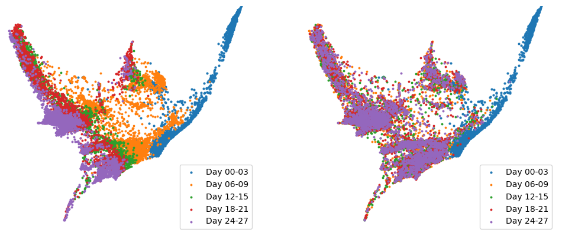

We will release the code upon publication. 

- [Brain signals matching (newly added)](#brain-signals-matching-newly-added)
  - [Datasets](#datasets)
  - [Results](#results)
  - [Ablation study on the normalizations of the graph Laplacian](#ablation-study-on-the-normalizations-of-the-graph-laplacian)
- [Single-cell data (newly added)](#single-cell-data-newly-added)
  - [How to apply our method to single-cell data?](#how-to-apply-our-method-to-single-cell-data)
  - [Results](#results-1)
  - [Details](#details)
- [Computational Complexity](#computational-complexity)
  - [Complexity comparison across different graph sizes](#complexity-comparison-across-different-graph-sizes)
  - [Complexity comparison across different datasets](#complexity-comparison-across-different-datasets)
- [References](#references)


## Brain signals matching (newly added)

### Datasets
We considered another application of the TSBM on a dataset of fMRI signals supported on human brains. Here, the task is to match the brain signals which are recorded from the different activities of the same subject. The used dataset is from the Human Connectome Project (HCP) Young Adult data set [1] and the details of the dataset can be found [here](https://www.humanconnectome.org/study/hcp-young-adult/document/1200-subjects-data-release).

To utilize the graph structure, we consider the HCP recommended brain atlas [2] and we can build a brain network which describes physical connection patterns between brain regions. Consider a graph $G=(V,A)$ with the node set $V$ and the adjacency matrix $A$. The brain regions encoded in the nodes are macroscale parcels of the brain, which are obtained based on a commonly used HCP's multimodal parcellation [2]. This leads to 180 cortical parcels for each hemisphere, resulting in a total of 360 regions (nodes) in the brain network, as shown below on the left. 


The weights in the adjacency matrix measure the strength of the axonal connections between two regions. This strength is built proportional to the inverse of the square distance between the regions [3]. 
We can then build the symmetric normalized graph Laplacian $L$. 
In our experiments, the two sets of signals, respectively, correspond to the liberal (as the initial) and aligned (as the final) activities. The former is associated with brain regions involved in high-level cognition, like decision making and memory, whereas the latter is associated with the sensory regions, like visual and auditory, meaning that functional signals are aligned with anatomical brain structure. 
The right figure above shows the different natures of the two sets of signals in terms of their energy mean. 

### Results 
We measure the performance of SB and TSB based matching and report the 1- and (square rooted) 2-Wasserstein distances below. 

| Method     | $W_1$     | $W_2$    |
|------------|-------------|-------------|
| SB-BM      | $12.08 \pm 0.08$ | $8.58 \pm 0.05$ |
| SB-VE      | $17.46 \pm 0.14$ | $12.42 \pm 0.09$ |
| SB-VP      | $13.41 \pm 0.05$ | $9.54 \pm 0.04$ |
| TSB-BM     | $7.51 \pm 0.08$ | $5.51 \pm 0.06$ |
| TSB-VE     | $7.59 \pm 0.05$ | $5.55 \pm 0.04$ |
| TSB-VP     | $7.67 \pm 0.11$ | $5.64 \pm 0.09$ |


**Illustrations**: Below we show the energies of the TSB-VE (Top) and SB-VE (Bottom) based sampled signals. The former is able to transport the signals to the final state where the signal has lower energy across the graph, whereas the latter fails to do so and remains very close to the initial state.  


### Ablation study on the normalizations of the graph Laplacian

Here we compare the performance of the TSB-based models using other ways of graph Laplacian normalizations. 
Specifically, we consider the random walk (RW) and the combinatorial (comb) normalizations. For the latter, we normalize it by dividing the maximal eigenvalue of the Laplacian.

| Method     | $W_1, L_{\rm{sym}}^{\rm{normalized}}$     | $W_2, L_{\rm{sym}}^{\rm{normalized}}$    | $W_1, L_{\rm{RW}}$     | $W_2, L_{\rm{RW}}$    | $W_1, L_{\rm{comb}}$     | $W_2, L_{\rm{comb}}$    |
|:----:|:----:|:----:|:----:|:----:| :----:|:----:|
| TSB-BM     | $7.51 \pm 0.08$ | $5.51 \pm 0.06$ | $7.51 \pm 0.08$ | $5.52 \pm 0.06$ |$8.06 \pm 0.05$|$5.80 \pm 0.04$|
| TSB-VE     | $7.59 \pm 0.05$ | $5.55 \pm 0.04$ | $7.62 \pm 0.09$ | $5.58 \pm 0.07$ | $9.21 \pm 0.06$|$6.62 \pm 0.05$|
| TSB-VP     | $7.67 \pm 0.11$ | $5.64 \pm 0.09$ | $7.65 \pm 0.09$ | $5.62 \pm 0.06$ | $9.29 \pm 0.05$|$6.73 \pm 0.03$|


## Single-cell data (newly added)

As suggested by reviewer 1, we here provide some results on the single-cell data. 

### How to apply our method to single-cell data?
We want to thank and acknowledge the reviewer for the suggestion on how to apply our framework to this kind of scenario where we have observations (data points) $x_1,\dots,x_k$ over $k$ timepoints and these data points (cells here) are moving. 
Reviewer 1 suggested to consider a graph topology using all the data points $X:=\cup_i x_i$, and then consider the transport of $x_1$ to $x_2$.
This transport can be done using our framework as follows: 

First, considering normalized indicator function on the graph topology: $\mu_1=1_{x_1}/\sum_{j}1_{x_1}(v_j)$ where $v_j$ is the node supporting the data points in $x_1$; similarly, we can define an indicator function for $x_2$, and then, we can tranport $\mu_1$ to $\mu_2=1_{x_2}/\sum_{j}1_{x_2}(v_j)$ using the TSB framework with them as the boundary distributions.

### Results 
We here showcase the results based on TSB-BM and SB-BM models: (left: groundtruth, right: predicted). We see that the former is able to capture the underlying dynamics and predict the the final and intermediate states well, whereas the latter fails to do so where the trajectory is very noisy especially the intermediate ones. 

**TSB-BM** 


**SB-BM** 




Below, we report the Wasserstein distances between the predicted and the ground truth coordinates at the final timepoints over five runs.

| Method | $W_1$ | $W_2$ |
|--------|-----|----|
| SB-BM  | 0.33 $\pm$ 0.01 | 0.40 $\pm$ 0.01   |
| SB-VE  | 0.33 $\pm$ 0.01 | 0.39 $\pm$ 0.01   |
| SB-VP  | 0.33 $\pm$ 0.01 | 0.40 $\pm$ 0.00   |
| TSB-BM | 0.14 $\pm$ 0.03 | 0.28 $\pm$ 0.05   |
| TSB-VE | 0.14 $\pm$ 0.02 | 0.27 $\pm$ 0.04   |
 |TSB-VP | 0.14 $\pm$ 0.01 | 0.22 $\pm$ 0.03 |

Moreover, we also evaluate the predictions at the intermediate timepoints based on our predicted labels. Note that _we used the data observations across the whole timespan to construct the graph_. 
| Timepoints | $W_1$, TSB-BM | $W_2$, TSB-BM  | $W_1$, BM  | $W_2$, BM   |
|------------|---------------|---------------|---------------|---------------|
| 2          | 0.03 ± 0.00   | 0.09 ± 0.00   | 0.52 ± 0.01   | 0.59 ± 0.01   |
| 3          | 0.09 ± 0.00   | 0.22 ± 0.01   | 0.12 ± 0.00   | 0.21 ± 0.00   |
| 4          | 0.08 ± 0.00   | 0.16 ± 0.01   | 0.19 ± 0.00   | 0.34 ± 0.00   |

Here, we measure the accuracy of the predicted data points labels at the four timepoints given the initial one. This also gives a measure of the predictions. 
| Method   | $t_2$   | $t_3$  | $t_4$   | $t_5$   |
|----------|---------|---------|---------|---------|
| SB-BM    | 0.28  | 0.23  | 0.26  | 0.24  |
| SB-BM$\star$  | 0.24  | 0.20  | 0.26  | 1.00  |
| TSB-BM   | 0.80  | 0.42  | 0.45  | 0.70  |

In a typical result by a TSB-model, the accuracy at the final timepoint can be high as close to 0.7. As for TSB-models, we made use of the graph constructed based on the whole set of the observations. Thus, we also perform leave-one-out training using the full set of observations for SB-BM, denoted by SB-BM$\star$, the accuracy at the final timepoint can reach 1.00. However, the intermediate predictions remain poor. This indicates the importance of the graph structure in the TSB-models and they better capture the underlying dynamics and predict the intermediate states.


### Details
The dataset here is single-cell embryoid body data from [here](https://data.mendeley.com/datasets/hhny5ff7yj/1) [4, 7], which describes the differentiation of human embryonic stem cells grown as embryoid bodies into diverse cell lineages over a period of 27 days. 
These cell data are collected at 5 timepoints (day 0-3, day 6-9, day 12-15, day 18-21, day 24-27), resulting in total 18,203 observations.
We followed the preprocessing steps provided by [TorchCFM: a Conditional Flow Marching library](https://github.com/atong01/conditional-flow-matching) [5, 6]. 
Followed by this, we consider the 2-dim [PHATE](https://www.nature.com/articles/s41587-019-0336-3) [7] embedding for the data. 
This leads to the data coordinates of dimension $18,203 \times 2$.
From the preprocessing, we can build a sparse kNN graph [4, 7] over the whole observed data. That is, we have an adjacency matrix $A$ of dimension $18,203 \times 18,203$.
In our experiment, we aim to transport the observed data from day 0-3 to day 24-27. Thus, we build the two boundary distributions based on the normalized indicator functions of the data points observed at these two timepoints.
After training the TSB models, using the final sample $y$ obtained from the learned forward transport conditioned on the initial distribution, we then obtain the predictions of the coordinates at the five timepoints based on the sorting (from large to small) of $y$ as follows. Given the indices after sorting, $\rm{idx} = {\rm{arg.sort}}(y)$, they can be disjointed as $\rm{idx}= S_1\cup S_2 \cup \dots \cup S_5$ with $|S_t|=n_t$ the number of observations at timepoint $t$ for $t=1,\dots,5$. We then have the prediction indicators for data points at timepoint $t$ given by $S_t$. 
The disjointed indices in $S_t$ provide essentially a labeling of the whole observations for the five timepoints. 
In our experiments, we found that using adjacency matrix $A$ as the convolution operator in the reference dynamics performs better. 


## Computational Complexity
### Complexity comparison across different graph sizes
Here we show the training time and memory comparisons for TSB and SB models using the different-sized Swiss roll graphs. 


** _sparse_ denotes the implementation of the graph Laplacian using ```torch.tensor().to_sparse()```. The test is done in a single stage with 2000 iterations and runs on a single NVIDIA RTX 3080 GPU.  

**Tabluar results**:

| Graph size       | Time SB-VE (s) | Time TSB-VE (s) | Time Increase | Memory SB-VE (MiB) | Memory TSB-VE (MiB) | Memory Increase |
|:----------------:|:--------------:|:---------------:|:-------------:|:------------------:|:-------------------:|:---------------:|
| 100              | 46.79          | 47.21           | 0.90%         | 504                | 504                 | 0%              |
| 200              | 46.28          | 46.68           | 0.86%         | 518                | 518                 | 0%              |
| 1,000            | 46.44          | 48.31           | 4.03%         | 606                | 618                 | 1.98%           |
| 2,000            | 47.51          | 49.00           | 3.14%         | 818                | 836                 | 2.20%           |
| 5,000            | 54.95          | 57.61           | 4.84%         | 1548               | 1712                | 10.59%          |
| 10,000           | 68.93          | 74.27           | 7.75%         | 2618               | 3432                | 23.72%          |
| 20,000           | 109.96         | 135.63          | 15.30%        | 4676               | 6756                | 44.48%          |
| 20,000, sparse   | 109.38         | 112.23          | 2.61%         | 4678               | 5140                | 9.88%           |
| 40,000, sparse   | 204.42         | 229.29          | 12.17%        | 8928               | 9734                | 9.03%           |

### Complexity comparison across different datasets

| Dataset       | Memory (MiB) - TSB-BM | Memory (MiB) - SB-BM | Memory Increase (%) | Training Time (s) - TSB-BM | Training Time (s) - SB-BM | Training Time Increase (%) |
|---------------|------------------------|-----------------------|----------------------|----------------------------|---------------------------|----------------------------|
| Seismic       | 516                    | 512                   | 0.78%               | 50.17                      | 51.48                     | -2.54%                    |
| Traffic       | 510                    | 504                   | 1.19%               | 52.25                      | 50.62                     | 3.22%                     |
| Ocean         | 5976                   | 5892                  | 1.43%               | 106.68                    | 102.67                    | 3.76%                    |
| Brain         | 486                    | 468                   | 3.85%               | 49.62                      | 48.97                     | 1.33%                     |
| Single-cell   | 4446                   | 4294                  | 3.54%               | 94.30                      | 92.54                     | 1.90%                     |


## References

[1] Van Essen, David C., Stephen M. Smith, Deanna M. Barch, Timothy E.J. Behrens, Essa Yacoub, and Kamil Ugurbil. “The WU-Minn Human Connectome Project: An Overview.” NeuroImage 80 (October 2013): 62–79. https://doi.org/10.1016/j.neuroimage.2013.05.041.

[2] Glasser, Matthew F., Timothy S. Coalson, Emma C. Robinson, Carl D. Hacker, John Harwell, Essa Yacoub, Kamil Ugurbil, et al. “A Multi-Modal Parcellation of Human Cerebral Cortex.” Nature 536, no. 7615 (August 2016): 171–78. https://doi.org/10.1038/nature18933.

[3] Perinelli, Alessio, Davide Tabarelli, Carlo Miniussi, and Leonardo Ricci. “Dependence of Connectivity on Geometric Distance in Brain Networks.” Scientific Reports 9, no. 1 (September 16, 2019): 13412. https://doi.org/10.1038/s41598-019-50106-2.

[4] Tong, Alexander (2023), “Processed Single-cell RNA Time Series DAta”, Mendeley Data, V1, doi: 10.17632/hhny5ff7yj.1

[5] A. Tong, N. Malkin, K. Fatras, L. Atanackovic, Y. Zhang, G. Huguet, G. Wolf, Y. Bengio. Simulation-Free Schrödinger Bridges via Score and Flow Matching, 2023.

[6] A. Tong, N. Malkin, G. Huguet, Y. Zhang, J. Rector-Brooks, K. Fatras, G. Wolf, Y. Bengio. Improving and Generalizing Flow-Based Generative Models with Minibatch Optimal Transport, 2023.

[7] Moon, van Dijk, Wang, Gigante et al. Visualizing Transitions and Structure for Biological Data Exploration. 2019. *Nature Biotechnology*.