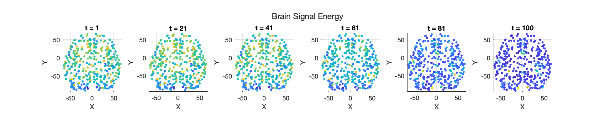

We will release the code upon publication. 


## Brain signals matching (newly added)

### Datasets
We considered another application of the TSBM on a dataset of fMRI signals supported on human brains. Here, the task is to match the brain signals which are recorded from the different activities of the same subject. The used dataset is from the Human Connectome Project (HCP) Young Adult data set [1] and the details of the dataset can be found [here](https://www.humanconnectome.org/study/hcp-young-adult/document/1200-subjects-data-release).

To utilize the graph structure, we consider the HCP recommended brain atlas [2] and we can build a brain network which describes physical connection patterns between brain regions. Consider a graph $G=(V,A)$ with the node set $V$ and the adjacency matrix $A$. The brain regions encoded in the nodes are macroscale parcels of the brain, which are obtained based on a commonly used HCP's multimodal parcellation [2]. This leads to 180 cortical parcels for each hemisphere, resulting in a total of 360 regions (nodes) in the brain network, as shown below on the left. 


The weights in the adjacency matrix measure the strength of the axonal connections between two regions. This strength is built proportional to the inverse of the square distance between the regions [3]. 
We can then build the symmetric normalized graph Laplacian $L$. 
In our experiments, the two sets of signals, respectively, correspond to the liberal (as the initial) and aligned (as the final) activities. The former is associated with brain regions involved in high-level cognition, like decision making and memory, whereas the latter is associated with the sensory regions, like visual and auditory, meaning that functional signals are aligned with anatomical brain structure. 
The right figure above shows the different natures of the two sets of signals in terms of their energy mean. 

### Results 
We measure the performance of SB and TSB based matching and report the 1- and (square rooted) 2-Wasserstein distances below. 

| Method     | $W_1$     | $W_2$    |
|------------|-------------|-------------|
| SB-BM      | $12.08 \pm 0.08$ | $8.58 \pm 0.05$ |
| SB-VE      | $17.46 \pm 0.14$ | $12.42 \pm 0.09$ |
| SB-VP      | $13.41 \pm 0.05$ | $9.54 \pm 0.04$ |
| TSB-BM     | $7.51 \pm 0.08$ | $5.51 \pm 0.06$ |
| TSB-VE     | $7.59 \pm 0.05$ | $5.55 \pm 0.04$ |
| TSB-VP     | $7.67 \pm 0.11$ | $5.64 \pm 0.09$ |


**Illustrations**: Below we show the energies of the TSB-VP (Top) and SB-VP (Bottom) based sampled signals. 




### Ablation study on the normalizations of the graph Laplacian

Here we compare the performance of the TSB-based models using other ways of graph Laplacian normalizations. 
Specifically, we consider the random walk (RW) and the combinatorial (comb) normalizations. For the latter, we normalize it by dividing the maximal eigenvalue of the Laplacian.

| Method     | $W_1, L_{\rm{sym}}^{\rm{normalized}}$     | $W_2, L_{\rm{sym}}^{\rm{normalized}}$    | $W_1, L_{\rm{RW}}$     | $W_2, L_{\rm{RW}}$    | $W_1, L_{\rm{comb}}$     | $W_2, L_{\rm{comb}}$    |
|:----:|:----:|:----:|:----:|:----:| :----:|:----:|
| TSB-BM     | $7.51 \pm 0.08$ | $5.51 \pm 0.06$ | $7.51 \pm 0.08$ | $5.52 \pm 0.06$ |$8.06 \pm 0.05$|$5.80 \pm 0.04$|
| TSB-VE     | $7.59 \pm 0.05$ | $5.55 \pm 0.04$ | $7.62 \pm 0.09$ | $5.58 \pm 0.07$ | $9.21 \pm 0.06$|$6.62 \pm 0.05$|
| TSB-VP     | $7.67 \pm 0.11$ | $5.64 \pm 0.09$ | $7.65 \pm 0.09$ | $5.62 \pm 0.06$ | $9.29 \pm 0.05$|$6.73 \pm 0.03$|


## Computational Complexity
Here we show the training time and memory comparisons for TSB and SB models using the different-sized Swiss roll graphs. 


** _sparse_ denotes the implementation of the graph Laplacian using ```torch.tensor().to_sparse()```. The test is done in a single stage with 2000 iterations and runs on a single NVIDIA RTX 3080 GPU.  

**Tabluar results**:

| Graph size       | Time SB-VE (s) | Time TSB-VE (s) | Time Increase | Memory SB-VE (MiB) | Memory TSB-VE (MiB) | Memory Increase |
|:----------------:|:--------------:|:---------------:|:-------------:|:------------------:|:-------------------:|:---------------:|
| 100              | 46.79          | 47.21           | 0.90%         | 504                | 504                 | 0%              |
| 200              | 46.28          | 46.68           | 0.86%         | 518                | 518                 | 0%              |
| 1,000            | 46.44          | 48.31           | 4.03%         | 606                | 618                 | 1.98%           |
| 2,000            | 47.51          | 49.00           | 3.14%         | 818                | 836                 | 2.20%           |
| 5,000            | 54.95          | 57.61           | 4.84%         | 1548               | 1712                | 10.59%          |
| 10,000           | 68.93          | 74.27           | 7.75%         | 2618               | 3432                | 23.72%          |
| 20,000           | 109.96         | 135.63          | 15.30%        | 4676               | 6756                | 44.48%          |
| 20,000, sparse   | 109.38         | 112.23          | 2.61%         | 4678               | 5140                | 9.88%           |
| 40,000, sparse   | 204.42         | 229.29          | 12.17%        | 8928               | 9734                | 9.03%           |


## References

[1] Van Essen, David C., Stephen M. Smith, Deanna M. Barch, Timothy E.J. Behrens, Essa Yacoub, and Kamil Ugurbil. “The WU-Minn Human Connectome Project: An Overview.” NeuroImage 80 (October 2013): 62–79. https://doi.org/10.1016/j.neuroimage.2013.05.041.

[2] Glasser, Matthew F., Timothy S. Coalson, Emma C. Robinson, Carl D. Hacker, John Harwell, Essa Yacoub, Kamil Ugurbil, et al. “A Multi-Modal Parcellation of Human Cerebral Cortex.” Nature 536, no. 7615 (August 2016): 171–78. https://doi.org/10.1038/nature18933.

[3] Perinelli, Alessio, Davide Tabarelli, Carlo Miniussi, and Leonardo Ricci. “Dependence of Connectivity on Geometric Distance in Brain Networks.” Scientific Reports 9, no. 1 (September 16, 2019): 13412. https://doi.org/10.1038/s41598-019-50106-2.